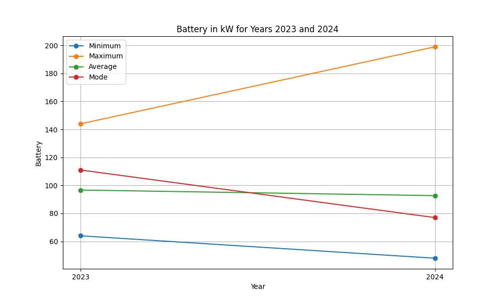
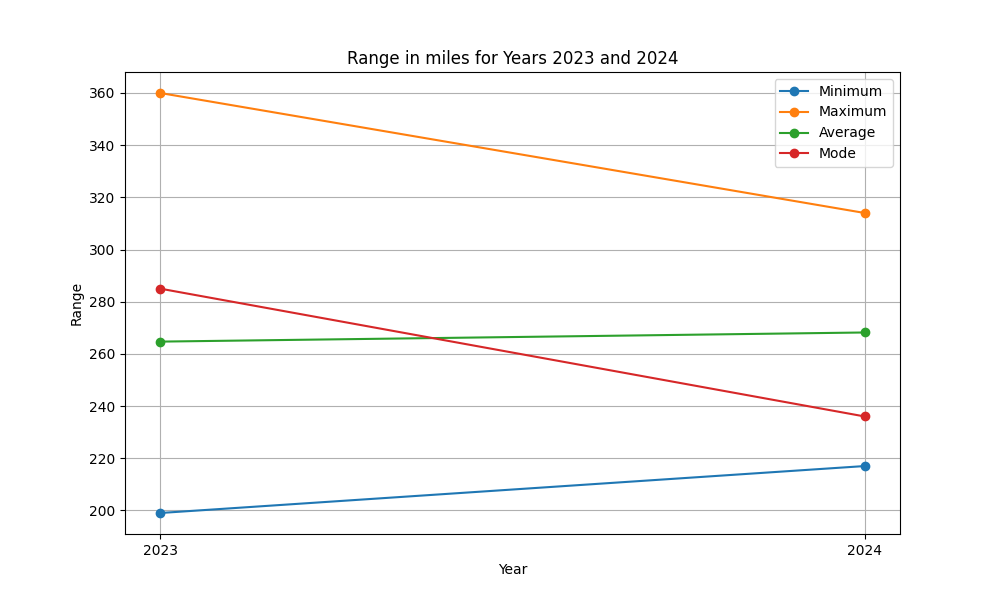
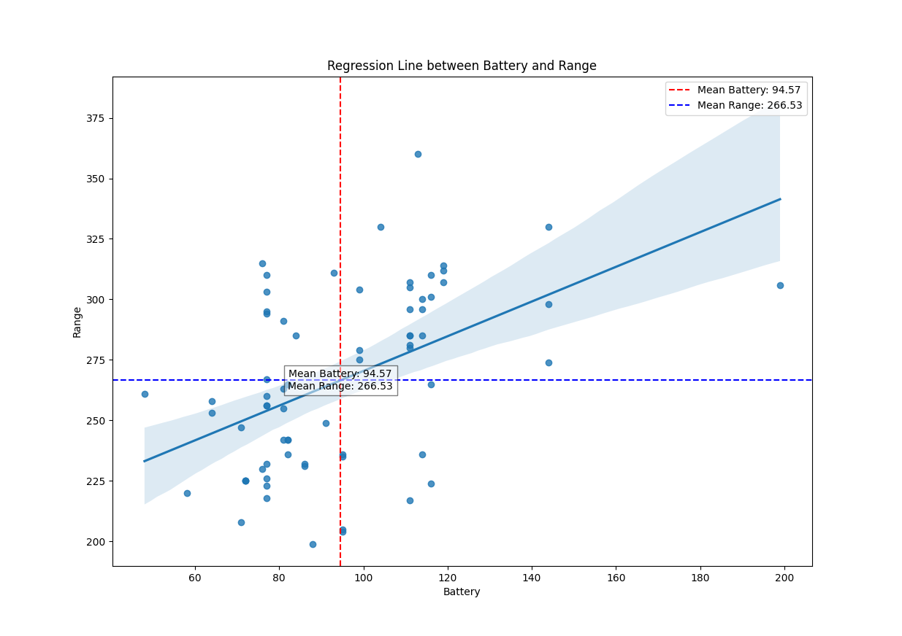

---
title: statistical analysis - EVs
layout: default
---

### Introduction

In my previous course (project management) I was working on an idea to convert ICE trucks to EV trucks. I noticed that the conversion idea itself took off but often with a polite hint of skepsis. The Skepsis as I found out later, was based on the fear of being stranded on the highway with a dead battery due to insufficient network of recharging stations. According to a Pew Research Center study, 53% of Americans have low levels of confidence that the US will build necessary EV infrastructure (survey conducted 05/30-06/04, 2023). 

So the question that I was trying to clarify for myself was: why would someone fear the lack of recharging opportunities when the range is comparable to an ICE?
Hence, the idea is to look if the capability to range actually suffices. To make it even more self evident I add the worse case scenario by looking at EVs that are bigger, heavier and therefore more vulnerable to being stranded on side of the road with an empty battery - SUV-EVs.

### Source of my selected dataset
The US department of Energy has a website which allows all sorts of selections in regard to EVs. My selection [link] included non commercial non fleet all electric SUV-EVs 
with the models from 2022 till 2024.
[link].

Key features of the dataset

The number of observations (rows) and variables (columns), as well as any unique identifiers or categorical variables.

I downloaded their excel file and converted to a csv file which entailed the years from 2024 till 2022.
Since the 2022 observations didn’t list data on the batteries variable, I had to leave them out of this analysis.

The remaining 7 variables and 70 observations (rows), a third of the data had not one specific number of miles as range but a range of miles in the ‘Range’ column. In each case I replaced the range of miles with its average.

### Level of measurement

For the purpose of this analysis I reduced the number of columns/variables to 7 

3 Nominal Variables
- Manufacturer
- Model
- Drivetrain
4 Interval Variables
- Year
- Range
- Battery
- Engine Size (e-motor)

### Libraries which I used in this analysis

- Python (For Coding)
- Pandas (Data Wrangling)
- NumPy (Numerical Analysis)
- Matplotlib (Data Visualization)
- Seaborn (Data Visualization)
- tabulate (Data Visualization)

### Limitations and shortcomings

The main focus of this report is not the use of software like SPSS and go into depth of the relationships and strength of the relationship between variables. The focus here is the application of python in the context of statistics. 
In a statistical report I would research more about for instance the baseline. Considering that the electricity grid in the US is already maxedout, where should all the additional electricity for EVs come from? Then I would ask what the maximum electricity capacity of California is in an attempt to determine how much electricity could be provided per car can and derive from that its range. This would give me a variable that could not be changed.
For the cultural significance, keep in mind that the American way of life included the freedom of movement. 
To find the current maximum capacity in California I would have to reach out to the California Energy Commission (CEC), the U.S. Energy Information Administration (EIA), and individual utility companies to get the numbers. Which is outside of the scope of this report and therefore there is no ceiling, no max.
Since there is no ceiling to which we can max out, yet - I will refer to my own little word.

From my own experience, the longest commute I’ve ever had in the Bay Area was 100 miles daily commute roundtrip and I had to refill every third day. Stop and go was the main reason for not lasting the entire week without a refill. So my expectation, my measurement therefore would be 300 miles range before the first refill/recharge.

The variable “Price” (the amount of money I would have to come up to get the car and the battery wall) is not or was not available. So even if the EV-SUV would be able to get me either 300 for three days or the 500 miles per week before recharging, the logical follow up question would be if I could even afford the upfront cost.

### Reliability 
1. The measure works for all cars in every country and should be consistent.

2. In general what we have to keep in mind that the size of the tires can have a huge impact on the range. Some models offer wheels from 20", 21", to 22”. But we will ignore this difference for now. There are so many variables (Drivetrain, height of the vehicle, ) that influence the range, we have to start with the basics.

3. Another point to make: companies change their prizes depending on the market.
Example: the car with the biggest range is the 2023  Fisker Automotive | Ocean Extreme, One. Fisker was lowering the MSRP of the 2023 Ocean Extreme trim by $24,000, to $37,499 from $61,499 MSRP. Fisker Announces Discounts in U.S. on Many 2023 Model Year Vehicles. [source]


### Validity => Getting what it Is suppose to measure. 
- The data that I put in determines the quality of the output. If my data does not include the prize of a car, it is hard to say what decision would be the reasonable one. Due to the scope of the analysis and the lack of data in regard to the US, there are some drawbacks in regard to validity.

### Analysis

- For 2024 there are 15 Manufacturers and for the year 2023 16.

- Minimum, Maximum, Average, and Mode of Range Variable grouped by Year


The average range would leave me stranded on the highway, 35 miles missing till home. But the maximum range would work. Now let’s look how big the battery would need to be.

These numbers are showing:
Batteries
- the biggest available batteries in 2023 got bigger in 2024, 
- the smallest available batteries got even smaller from 2023 to 2024. 



Range
- the maximum range came down from 2023 to 2024
- the minimal range went up from 2023 to 2024.




### Now, the follow up question here is: 

- is it better to buy a bigger battery because the more range I get out of it?




---

### Appendix

- cleaning data [* NULL means unknown or missing data.]

```python
import pandas as pd

df = pd.read_csv('EVSUV_20242023.csv')

# Replace 'NULL' with NaN
df.replace('NULL', pd.NA, inplace=True)

# Get distinct values of Year, Battery, and Range
distinct_years = df['Year'].unique().tolist()
distinct_batteries = df['Battery'].unique().tolist()
distinct_ranges = df['Range'].unique().tolist()

distinct_years.sort()
distinct_batteries.sort()
distinct_ranges.sort()

print("Distinct Years:")
print(distinct_years)

print("\nDistinct Batteries:")
print(distinct_batteries)

print("\nDistinct Ranges:")
print(distinct_ranges)
```

```sql
SELECT DISTINCT Year
FROM EVSUV_20242023
ORDER BY Year;

SELECT DISTINCT Battery
FROM EVSUV_20242023
ORDER BY Battery;

SELECT DISTINCT Range
FROM EVSUV_20242023
ORDER BY Range;
```

* Manufacturers by year
  
```python
import pandas as pd
from tabulate import tabulate

# pull in pandas DataFrame
df = pd.read_csv('EVSUV_20242023.csv')

# Filter DataFrame for years 2023 and 2024
df_filtered = df[df['Year'].isin([2023, 2024])]


# manufacturer_counts = df.groupby(['Year'])['Manufacturer'].nunique().reset_index()

# Group by Year and Manufacturer, then count the number of unique manufacturers
manufacturer_counts = df_filtered.groupby(['Year'])['Manufacturer'].nunique().reset_index()

# Rename column (readability)
manufacturer_counts.rename(columns={'Manufacturer': 'Number of Manufacturers'}, inplace=True)


print("Number of Manufacturers grouped by Year:")
print(tabulate(manufacturer_counts, headers='keys', tablefmt='psql'))
```

* min, max, avg of Range 
```python
import sqlite3
import pandas as pd
import numpy as np
from tabulate import tabulate

''' NumPy can do
* sum, product
* minimum, maximum
* Median, average, mean and standard deviaation
* Histogram
'''


df = pd.read_csv('EVSUV_20242023.csv')
conn = sqlite3.connect('EVSUV_20242023.db')
df.to_sql('EVSUV_20242023', conn, index=False, if_exists='replace')
# Commit changes (meaning save it)
conn.commit()

# min, max, avg of Range 
query = """
        SELECT 
            MIN(Range) AS Min_Range,
            MAX(Range) AS Max_Range,
            AVG(Range) AS Avg_Range
        FROM 
            EVSUV_20242023
        """
results = pd.read_sql_query(query, conn)

# Converting 'Range' column to NumPy array
range_array = np.array(df['Range'])

# minimum, maximum, average using NumPy
min_range = np.min(range_array)
max_range = np.max(range_array)
avg_range = np.mean(range_array)

# DataFrame for results
results_np = pd.DataFrame({
    'Min_Range': [min_range],
    'Max_Range': [max_range],
    'Avg_Range': [avg_range]
})

print("Minimum, Maximum, Average of Range variable:")
print(tabulate(results_np, headers='keys', tablefmt='psql'))

# Close the connection
conn.close()
```
