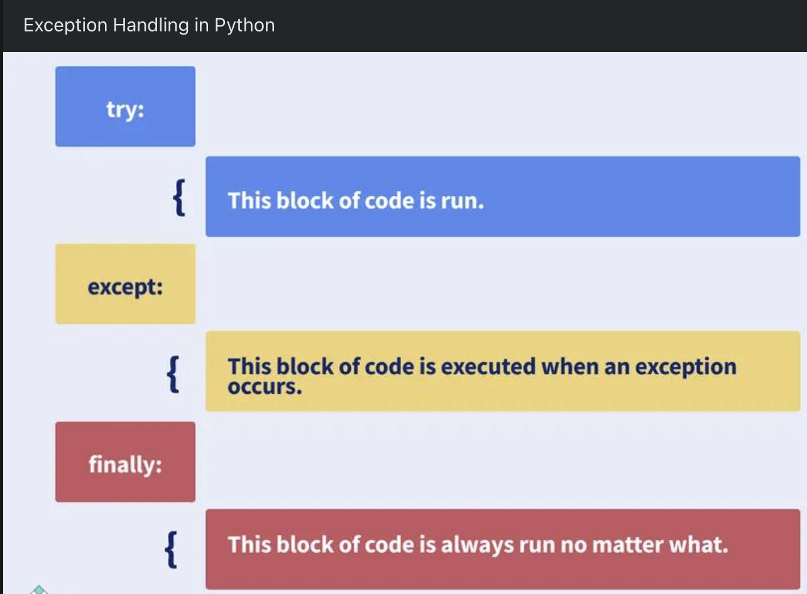

## Exceptions 
> Even if a statement of expression is syntactically correct, errors may still occure when a program is running.



### Exceptions: 
* are errors deteccted during Execution.
* are thrown or raised from anywhere in a program.
* print a descriptive error message and/or debugging information (name of th file and the line where the eror occured).
* terminate a program.

### ValueError: 

* source: int(), float(). and many more
* Trigger: operand or argument has the right type but an inappropriate value. 

```python
print(int('one handred'))
# int will throw a Value exception
# invalid literal for int()
```

### TypeError:

* Source: multiple operators and fucntions
* Trigger: operand or argument has the wrong type

### ZeroDivisionError:

* Source: division and modulo operators
* Trigger: dividing by zero

### NameError:

* Source: expression with variable
* Trigger: usign a variable that has not been declared

### IndexError:

* Source: sequence index operator
* Trigger: accessing an index that is out of range

```python
mylist = [1,2,3]
print(mylist[10])
#this will cause an indexerror
print('finished')
```

### KeyError:

* Source: dictionary index operator
* Trigger: accessing a key that does not exist

* friendlier error message
* fixing problem without exiting
* offer alternatives

### Catching Exceptions

```python
try:
    try_block
Except exception_type:
    exception_block

# multiple
try:
    try_block
Except exception_type1:
    exception_block1
Except exception_type2:
    exception_block2
```

### Example

```python
mylist = [1,2,3]
try:
    print(mylist[10])
    print('got item at index 10')
except IndexError:
    print('mylist index is out of bounds')
print('finished')
```

## Open function Exceptions

### FileExistsError:

* Source: 
* Trigger: attempting to overwrite to a file that exists

### FileNotFoundError:

* Source: 
* Trigger: filename does not exist

### PermissionError:

* Source: 
* Trigger: operation not allwoed based on permissions

### IsADirectoryError:

* Source: 
* Trigger: accessing a directory as if it were a file

```python
try:
    with open('does_not_exist.txt') as f:
        print(f.read())
except PermissionError:
    print('file permission error')
except FileNotFoundError:
    print('does_not_exist.txt' not found)
```

Exceptions handling questions could be
* what are Exceptions
* Exception Types
* Why Catch Exceptions
* Catchign Exceptions
* Open function Exceptions

---

|| [Strings](./strings.html) || [Variables](./variables.html) || [Lists](./lists.html) || [Tuples](./tuples.html) || [Dictionary](./dictionary.html) ||
|| [Control](./control.html) || [Function](./function.html)|| [Files](./files.html) || [Exceptions](./exceptions.html) ||
|| [OOP](./oop.html) || [Algorithm](./algorithm.html) ||[Data Structure](./datastructure.html) ||[back](./index.html)

---
